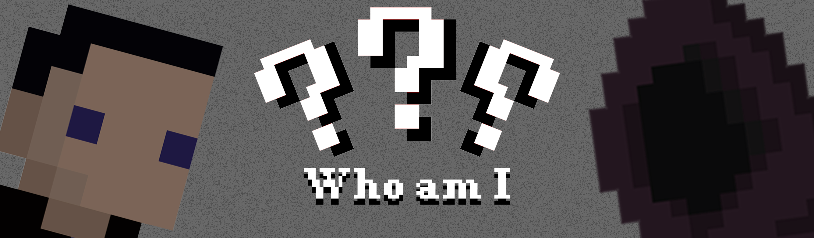
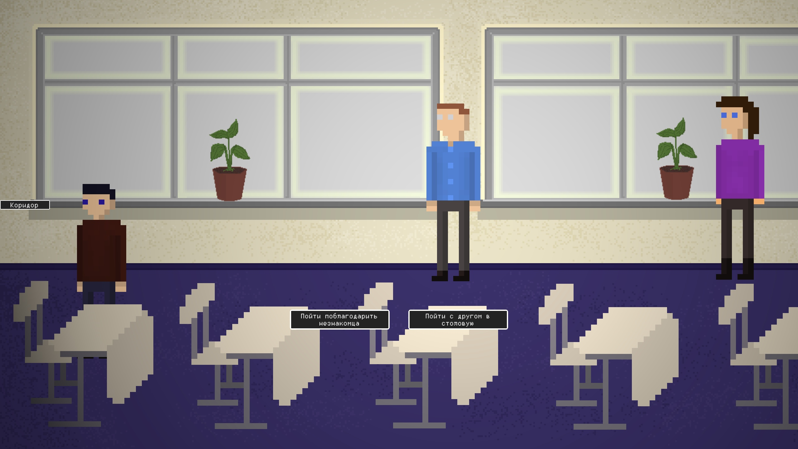
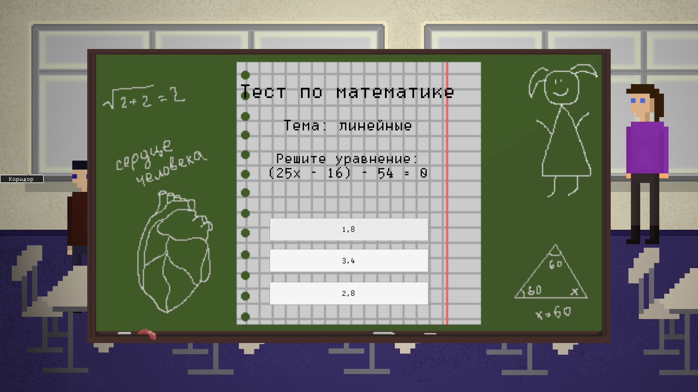

<h2>Описание</h2>
<b>Тип проекта:</b> платформерная 2D игра в жанре приключения с элементами квеста, детектива и возможностью выбора, влияющего на концовку.
<b>Краткое описание:</b> при загадочных обстоятельствах главный герой теряет память. Ему придётся пройти через все этапы жизни, чтобы узнать свою судьбу.
<h2>Игровой процесс</h2>
<ul>
<li><b>Передвижение</b> осуществляется стандартной раскладкой(<b>W,A,S,D</b>).</li>
<li>В игре есть механика подбора <b>предметов</b> мышкой и дальнейшее их использование через <b>инвентарь</b>!</li>
<li> Присутствуют <b>диалоговая система </b>и<b> всплывающие подсказки</b>.</li>
<li> В игре также существует <b>квестовая система</b>!</li>
</ul>
<h2>Демо</h2>
<h3>Анимация начала игры</h3>

<h3>Окно диалога</h3>

<h3>Возможность выбора</h3>

<h3>Мини игры</h3>

<h2>Attention!</h2>
<ul>
<li>Картинка игры может некорректно отображаться при низких разрешениях экрана!</li>
<li>Сохранение игрового процесса работает еще не полностью!</li>
<li>Кнопка удаляение настроек в главном меню создана для того, чтобы удалить сохраненные на компьютере настройки после завершения игры!</li>
</ul>